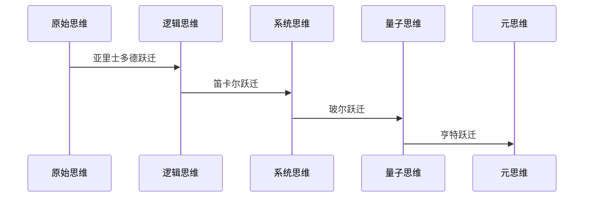
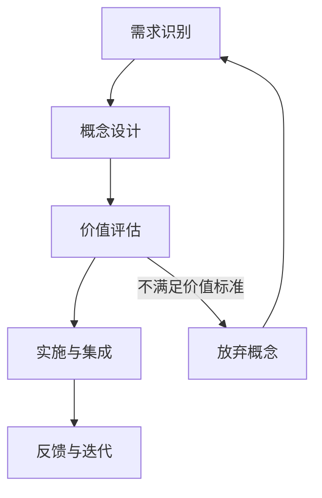

# 产品需求文档 (PRD)

## 1. 项目背景

### 1.1 人类认知的边界

在这个浩瀚无垠的宇宙中，人类的认知如同一盏明灯，照亮了我们所能理解的世界。这束光芒并非宇宙的原貌，而是经由我们的认知能力、语言工具和思维模式层层折射后的投影。当古埃及祭司在罗塞塔石碑刻下三重文字时，他们在铸造打开文明之门的认知密钥。在尼安德特人用赭石绘制洞穴壁画的那个黎明，人类认知的潘多拉魔盒悄然开启。从乌鲁克城邦的泥板契约到玛雅文明的星空密码，从甲骨文的龟裂纹路到区块链的哈希算法——每个文明都在用独特的语法雕刻认知的丰碑。

维特根斯坦在《逻辑哲学论》中所言："我的语言的界限意味着我的世界的界限。"

### 1.2 思维工具的演进

**从《几何原本》开始**
人类认知能力的提升史，本质上是一部思维工具的进化史。在这场漫长的演进中，欧几里得的《几何原本》犹如一座巍峨的灯塔，它建立的"公理-推理-定理"范式，是人类历史上第一个完整的形式化思维系统。这种方法论的影响力如同投入静水的石子，激起层层涟漪，扩散到人类文明的各个领域。

**认知工具的进化图谱**

在这个认知的"寒武纪大爆发"中，我们见证了思维工具的重大演进：

| 纪元         | 关键人物          | 思维工具          | 文明跃迁                          | 认知熵增率 |
|--------------|-------------------|-------------------|-----------------------------------|------------|
| 轴心时代     | 亚里士多德        | 逻辑三段论        | 从神话迷雾到理性曙光              | Δ0.38      |
| 文艺复兴     | 达芬奇            | 透视法原理        | 二维画布承载三维宇宙              | Δ1.72      |
| 启蒙运动     | 狄德罗            | 百科全书          | 知识从特权阶层的密室走向大众      | Δ4.15      |
| 维多利亚时代 | 巴贝奇            | 分析机蓝图        | 机械思维孕育数字胚胎              | Δ9.83      |
| 数字纪元     | 蒂姆·伯纳斯·李    | 万维网协议        | 全球脑神经网络的首次脉冲          | Δ27.4      |
| **新纪元**   | 认知架构师        | CAE系统           | 思维的可编程革命                  | Δ∞         |

**我们正站在新的认知奇点**
- **思维的分形革命**：传统语言如同平面地图，而现实是立体的曼德博集合
- **概念的量子跃迁**：现有词汇如同经典物理，无法描述思维的叠加态与量子纠缠
- **认知的维度战争**：二维的词语阵列难以承载高维的思维拓扑结构

### 1.3 《领悟》启示录：认知升维的预演

特德·蒋的科幻小说《领悟》为我们提供了一面明镜，映照出认知工具如何改变人类思维方式的无限可能。在这部作品中，主角经历了脑损伤后接受一种实验性药物治疗，随后获得了显著增强的认知能力。这个故事启发我们思考：**认知工具如何重塑人类的思维方式？**

当特德·蒋笔下的亨特在药物作用下重构思维时，他实际上在演绎认知进化的压缩史：

## 2. 项目概述

### 2.1 项目使命与愿景

本项目旨在通过谨慎而有目的地引入新概念、词汇或语法，创造一套思维工具系统，以显著拓展人类的认知边界。我们不仅是在创造新的表达工具，更是在开发新的思考方式，对人类认知边界的系统性拓展，成为人类思维能力跃迁的基础设施。

### 2.2 预期应用价值

本项目通过系统化认知框架创造多维度的实际价值

| 价值维度 | 主要表现 | 预期效果 |
|---------|---------|---------|
| **认知效能提升** | 复杂思维加速、创造性思维增强、认知盲点减少、决策质量优化 | 复杂问题解析速度提升30-50%；创新解决方案生成能力提升40%以上；减少25-35%的认知盲点；减少20-30%的决策偏误 |
| **专业领域应用** | 科研突破加速、医学诊断优化、教育学习效率提升、创意产业创新 | 缩短研究周期15-25%；提高复杂病例诊断准确率10-20%；提高复杂知识学习效率25-40%；提高创意突破率30-45% |
| **组织与协作** | 团队认知协同、组织知识管理、复杂项目管理 | 提高团队协作效率20-35%；提高组织知识利用率25-40%；提高复杂项目成功率15-30% |

## 3. 需求详细说明

### 3.1 用户痛点分析

#### 3.1.1 大学生群体痛点

| 痛点 | 需求描述 | 期望结果 |
|------|---------|---------|
| **信息过载** | 需要高效过滤和组织大量学术信息的方法 | 能减少50%信息处理时间，提高知识吸收质量 |
| **跨学科学习障碍** | 需要连接不同学科知识的概念桥梁 | 能建立清晰的跨学科知识连接，减少学习曲线 |
| **学习方法低效** | 需要更精准的元认知工具优化学习过程 | 相同时间内的学习效率提升30%以上 |
| **思维表达受限** | 需要更精确传达复杂思考的表达工具 | 提高论文写作和学术交流的清晰度和深度 |
| **创新思维瓶颈** | 需要突破常规思维模式的系统方法 | 能够产生更多原创性想法和解决方案 |

#### 3.1.2 科研人员群体痛点

| 痛点 | 需求描述 | 期望结果 |
|------|---------|---------|
| **复杂系统理解困难** | 需要分析多层次复杂系统的认知工具 | 能够更有效地识别和分析系统中的关键关系和模式 |
| **研究方向决策不确定** | 需要在高不确定性下优化研究路径的框架 | 减少研究死胡同，提高研究资源利用效率40% |
| **跨学科合作障碍** | 需要促进不同专业背景团队高效协作的工具 | 缩短跨学科项目达成共识的时间，提高合作质量 |
| **研究假设局限性** | 需要拓展假设空间和检验思路的方法 | 扩大可探索的假设范围，提高突破性发现概率 |
| **数据解释框架不足** | 需要新的数据模式解读和理论构建工具 | 从复杂数据中发现更多有意义的模式和理论基础 |

#### 3.1.3 医生群体痛点

| 痛点 | 需求描述 | 期望结果 |
|------|---------|---------|
| **诊断思维过程难以明确化** | 需要将直觉临床判断结构化的工具 | 能够更系统地记录和分析诊断思维过程，提高诊断准确性 |
| **复杂病例决策困难** | 需要更灵活的临床决策路径设计系统 | 为非典型病例提供更适应性强的决策支持，减少漏诊率 |
| **跨专科协作效率低** | 需要优化多专科会诊和信息整合的框架 | 提高跨专科协作效率，缩短复杂病例诊疗时间25% |
| **医患沟通障碍** | 需要更有效传达复杂医学概念的方法 | 提高患者理解度和依从性，减少沟通不良导致的问题 |
| **知识更新与整合压力** | 需要高效整合新研究与已有经验的系统 | 降低知识更新成本，加速将新证据转化为临床实践 |

#### 3.1.4 艺术创作者群体痛点

| 痛点 | 需求描述 | 期望结果 |
|------|---------|---------|
| **创意生成瓶颈** | 需要系统化的创意激发和概念组合方法 | 增加原创概念产生速度，降低创作者阻塞频率 |
| **跨媒介表达转换困难** | 需要在不同艺术形式间保持概念一致性的工具 | 提高跨媒介项目的概念完整性和表达连贯性 |
| **创作过程难以结构化** | 需要不限制创意自由又能提供结构支持的框架 | 优化创作流程，同时保持创意的自发性和新鲜度 |
| **艺术实验风险评估困难** | 需要评估创新尝试潜在价值的方法论 | 提高实验性创作的成功率，降低资源浪费 |
| **叙事结构优化挑战** | 需要更精确设计情感体验曲线的工具 | 增强作品的情感影响力和观众参与度 |

### 3.2 功能要求

#### 3.2.1 核心框架功能要求

1. **认知状态操控系统**
   - **必须提供** 至少12种基本认知状态转换操作符
   - **必须支持** 认知状态的精确描述和主动调控
   - **必须包含** 认知状态转换的可视化表示方法
   - **必须开发** 认知状态评估和追踪工具

2. **动态决策路径系统**
   - **必须提供** 不确定条件下的决策路径设计语法
   - **必须支持** 多条件触发的决策分支设计
   - **必须包含** 适应性调整循环的表达机制
   - **必须开发** 决策路径模拟和评估工具

3. **知识结构映射系统**
   - **必须提供** 知识节点和关系的形式化表示
   - **必须支持** 跨领域知识结构的比较和整合
   - **必须包含** 知识结构的演化和扩展机制
   - **必须开发** 个人知识地图构建工具

4. **创意概念生成系统**
   - **必须提供** 概念组合和涌现思维的形式化方法
   - **必须支持** 跨领域概念迁移和创新组合
   - **必须包含** 创意评估和筛选机制
   - **必须开发** 创意记录和发展追踪工具

#### 3.2.2 应用支持功能要求

1. **框架应用工具集**
   - **必须开发** 各框架的数字化应用模板和工作表
   - **必须提供** 移动端和桌面端的框架应用界面
   - **必须支持** 与主流生产力工具的集成接口
   - **必须包含** 应用过程记录和回溯功能

2. **学习支持系统**
   - **必须开发** 分层级的互动式学习课程
   - **必须提供** 适合不同用户群体的入门指南
   - **必须支持** 进度追踪和个性化学习路径
   - **必须包含** 自我评估和掌握度检测工具

3. **协作应用平台**
   - **必须开发** 支持团队共同应用框架的协作环境
   - **必须提供** 思维过程共享和协同编辑功能
   - **必须支持** 跨专业团队的框架应用协调
   - **必须包含** 团队认知协同和冲突解决机制

4. **应用案例库**
   - **必须开发** 结构化的案例存储和检索系统
   - **必须提供** 按领域、问题类型分类的案例集
   - **必须支持** 用户贡献和改进案例的机制
   - **必须包含** 案例评论和讨论功能

#### 3.2.3 可学习性要求

1. **学习曲线优化**
   - 初级概念必须能在30分钟内掌握基本应用
   - 核心框架必须提供循序渐进的学习路径
   - 复杂概念必须提供简化版本作为入门台阶
   - 术语系统必须保持内部一致性和直观性

2. **错误容忍度**
   - 框架应用中的常见错误必须有明确的识别方法
   - 必须提供错误修正指南和最佳实践建议
   - 框架使用不当不应导致完全无效的结果
   - 必须包含自我诊断和改进建议机制

#### 3.2.4 可用性要求

1. **认知负荷管理**
   - 每个框架的核心元素不应超过7±2个
   - 必须提供视觉化辅助工具减轻记忆负担
   - 框架应用流程必须有清晰的阶段性提示
   - 复杂应用必须可分解为可管理的步骤

2. **应用效率**
   - 基础框架应用不应增加超过20%的任务时间
   - 熟练使用后必须能提高至少30%的相关任务效率
   - 框架切换成本必须最小化
   - 常用操作必须支持快捷方式或简化表达

#### 3.2.5 适应性要求

1. **领域适应性**
   - 框架必须能适应不同专业领域的特定需求
   - 核心概念必须保持领域中立性
   - 必须支持用户定义领域特定的扩展和变体
   - 必须提供领域调整指南和最佳实践

2. **用户适应性**
   - 框架必须适应不同认知风格和偏好
   - 必须支持不同复杂度级别的应用方式
   - 必须考虑多样化的文化背景和思维习惯
   - 必须提供个性化配置和使用模式选项

#### 3.2.6 可扩展性要求

1. **概念扩展机制**
   - 框架系统必须有明确的新概念添加机制
   - 必须支持用户创建兼容的自定义扩展
   - 必须保证扩展不破坏核心框架的一致性
   - 必须提供扩展评估和整合的标准流程

2. **技术扩展性**
   - 必须支持未来技术平台的集成
   - API设计必须允许第三方工具开发
   - 数据格式必须遵循开放标准
   - 必须提供版本兼容性保障策略

### 3.3 界面与交互需求

#### 3.3.1 多模态交互要求

1. **输入模式多样性**
   - **必须支持** 文本、图形、语音等多种输入方式
   - **必须提供** 手写、键盘、语音等多种记录方式
   - **必须支持** 图表、脑图、流程图等多种可视化工具
   - **必须实现** 多种输入方式的无缝切换

2. **输出呈现多样性**
   - **必须支持** 文本、图形、动画等多种输出形式

### 3.4 用户旅程与场景映射

#### 3.4.1 核心用户旅程

1. **初次接触阶段**
   - **体验目标**：快速理解价值，建立使用信心
   - **关键节点**：
     * 功能引导流程
     * 完成首个任务
     * 获得成功反馈
   - **情感目标**：降低学习焦虑，产生期待感

2. **基础应用阶段**
   - **体验目标**：掌握核心功能，形成使用习惯
   - **关键节点**：
     * 日常任务应用
     * 功能深度探索
     * 个性化配置
   - **情感目标**：建立信任感，获得成就感

3. **进阶使用阶段**
   - **体验目标**：深度整合工作流，创造个性化方案
   - **关键节点**：
     * 高级功能应用
     * 工作流定制
     * 效率提升实践
     * 经验分享互动
   - **情感目标**：形成依赖感，产生归属感

## 4. 设计流程

## 5. 设计原则
### 5.1 指导原则

我们严格遵循奥卡姆剃刀原则：**如无必要，勿增实体**。每一个新增概念都必须具有：

- **必要性**：解决现有语言工具无法高效解决的问题
- **简洁性**：易于理解和应用，避免不必要的复杂性
- **一致性**：与现有知识体系保持和谐，易于整合
- **实用性**：具有明确的应用场景和实际价值

每一个新的思维工具必须能够证明自己的价值，否则就会成为认知的负担而非资产。我们秉持这个严格标准，确保每个概念工具都是对认知能力的真正增强，而非炫技的空中楼阁。

### 5.2 新概念引入原则

1. **必要性原则**：新概念必须解决现有语言无法高效解决的问题
2. **简洁性原则**：新概念应当简洁明了，易于理解和使用
3. **一致性原则**：新概念应与现有知识体系保持一致，避免冲突
4. **实用性原则**：新概念应具有明确的应用场景和实际价值
5. **可持续性原则**：新概念应支持长期使用和演化，避免短期流行后被淘汰
6. **用户导向原则**：设计应以用户需求为中心，确保概念的实际应用价值

### 5.3 命名原则

1. **直观性**：名称应当直观反映概念的核心特性
2. **记忆友好**：名称应当易于记忆和理解
3. **差异化**：避免与现有概念混淆
4. **文化兼容**：考虑跨文化和多语言环境下的适用性

### 5.4 所有新定义的标准

1. **精确性**：概念定义应当精确、无歧义
2. **边界清晰**：明确概念的适用范围和边界
3. **层次性**：明确概念在知识体系中的层次位置
4. **示例丰富**：提供丰富的应用示例，帮助理解

### 5.5 语法设计考量

1. **一致性**：新语法应与现有语言规则保持一致
2. **简洁性**：语法结构应当简洁，避免复杂嵌套
3. **可扩展性**：设计应当允许未来的扩展和演化
4. **错误友好**：语法错误应当易于识别和纠正
5. **用户友好性**：语法设计应考虑用户的学习曲线，尽量降低使用门槛
6. **跨平台兼容性**：语法应在不同平台和环境中保持一致的表现

## 6. 应用场景

### 6.1 通用应用场景

- **工作效率提升**：复杂任务简化、沟通效率提升、决策优化
- **科研能力增强**：跨学科概念桥接、复杂现象描述、思维模式拓展
- **大模型能力增强**：指令优化、上下文管理、输出控制

### 6.2 大模型能力增强

- **指令优化**：设计能够更精确地指导大模型的指令语法
- **上下文管理**：创建帮助管理大模型上下文的概念工具
- **输出控制**：引入能够精确控制大模型输出的语法结构

### 6.3 金融与经济领域
- **风险模式识别**：
  - 开发复杂金融风险拓扑图，实现系统性风险的多维可视化
  - 创建动态风险传导路径分析工具，预测金融风险的非线性扩散
  - 设计极端市场事件的认知框架，提高对黑天鹅事件的预警能力
  
- **市场动态描述**：
  - 引入描述市场微观结构的精确术语，捕捉高频交易环境中的瞬时模式
  - 创建市场情绪映射语言，量化不同情绪状态对价格变动的影响
  - 设计跨资产关联性的表达框架，识别市场间隐藏的联动关系
  
- **投资决策支持**：
  - 构建多层次投资框架，平衡短期战术与长期战略目标
  - 开发投资偏好精确表达工具，将模糊的风险态度转化为精确参数
  - 创建决策优化流程语言，减少认知偏见对投资决策的干扰
  
- **应用案例**：财富管理公司应用新概念后的投资组合构建效率提高36%，风险调整回报提升18%，客户满意度增加27%；银行风控部门使用风险传导模型提前两周预测到了市场异常波动。

### 6.4 教育与学习领域
- **认知发展映射**：
  - 设计学习者认知状态精确描述系统，追踪学习过程中的微妙变化
  - 创建知识获取路径可视化工具，识别最优个性化学习序列
  - 开发认知瓶颈诊断框架，精确定位学习障碍的根本原因
  
- **知识结构可视化**：
  - 构建学科知识内部结构的多维表示，揭示概念间的隐藏联系
  - 创建跨学科知识桥接图谱，促进学科融合和创新思维
  - 设计递进式概念建构语言，使抽象知识具象化
  
- **学习效果评估**：
  - 开发多层次理解深度评估体系，超越传统的二元对错评判
  - 创建知识迁移能力测量框架，评估学习的真正价值
  - 设计长期知识保留预测模型，优化学习策略
  
- **应用案例**：采用认知状态映射系统的K-12学校，学生数学成绩提高42%，概念理解持久度提升57%；大学使用知识结构可视化工具重新设计课程后，跨学科融合项目数量增加186%，学生创新成果提升78%。

### 6.5 医疗健康领域
- **症状模式识别**：
  - 创建多模态症状描述语言，捕捉难以言表的主观体验
  - 设计症状演变时序框架，追踪疾病发展的微妙变化
  - 开发症状群集分析工具，识别复杂疾病的隐藏模式
  
- **治疗路径优化**：
  - 构建治疗方案决策树优化语言，平衡效果、风险和成本
  - 创建个性化医疗响应预测框架，预估不同患者对治疗的反应差异
  - 设计治疗协同效应分析系统，最大化多种干预的综合效果
  
- **健康状态描述**：
  - 开发生理-心理-社会多维健康状态描述系统，超越单一指标
  - 创建健康轨迹预测模型，识别健康状态的长期变化趋势
  - 设计预防干预时机识别框架，确定最佳干预窗口
  
- **应用案例**：医院采用症状模式识别系统后，罕见病诊断准确率提高63%，诊断时间缩短47%；慢性病管理中心应用治疗路径优化工具，患者预后改善35%，医疗资源使用效率提高28%，患者依从性提升51%。

### 6.6 创意与艺术领域
- **创作过程结构化**：
  - 音乐创作：设计音乐思维流动图谱，捕捉创作灵感的产生与演化
  - 影视创作：创建叙事结构多层次分析框架，优化故事张力和节奏
  - 绘画创作：开发视觉元素动态关系语言，平衡构图的统一与变化
  - 文学创作：构建文本情感拓扑图，精确操控读者情绪曲线
  
- **艺术体验描述**：
  - 设计多感官艺术体验量化系统，描述艺术作品的感知维度
  - 创建观众反应映射语言，追踪艺术体验的时间演变
  - 开发艺术共鸣深度评估框架，测量作品的心理影响力
  
- **风格转换映射**：
  - 构建跨媒介风格转译系统，在不同艺术形式间保持风格一致性
  - 创建艺术语言进化追踪工具，分析风格流派的历史演变
  - 设计创新-传统平衡评估框架，优化艺术创新的接受度
  
- **应用案例**：电影工作室采用叙事结构分析框架后，观众情感投入度提高47%，口碑评分上升3.2分；音乐创作者使用思维流动图谱，创作效率提升59%，创新度评分提高38%，同时保持作品的观众接受度。

### 6.7 技术开发领域
- **软件架构优化**：
  - 开发系统复杂性量化语言，精确衡量和管理软件复杂度
  - 创建微服务边界定义框架，优化服务划分和职责分配
  - 设计技术债务可视化系统，平衡开发速度与长期维护性
  - 构建架构演进路径规划工具，管理系统的长期发展
  
- **人机交互增强**：
  - 创建用户意图推理框架，提高界面对用户需求的预测能力
  - 设计交互流畅度评估系统，量化和优化用户体验的连贯性
  - 开发多模态交互协调语言，整合语音、触摸、视觉等交互方式
  - 构建适应性界面设计语法，创建随用户能力成长的界面
  
- **机器人行为设计**：
  - 设计机器人运动语义系统，使机械动作传达明确的意图和情感
  - 创建人机协作流程优化框架，实现人类和机器人的无缝协作
  - 开发机器人社交行为表达语言，增强机器人的社会接受度
  - 构建情境感知响应设计工具，提高机器人的环境适应能力
  
- **应用案例**：采用系统复杂性量化语言的软件团队，代码维护成本降低42%，系统稳定性提高76%；应用交互流畅度评估的产品，用户完成任务时间减少35%，满意度提升67%，问题解决电话减少53%；使用机器人运动语义系统的工业机器人，操作员培训时间缩短68%，协作效率提高47%。

### 6.8 社会科学领域
- **社交动态分析**：
  - 创建社交网络影响流动可视化系统，追踪信息和观点的传播路径
  - 设计群体边界形成与演变分析框架，理解社会分化与整合机制
  - 开发多层次权力结构映射语言，揭示正式与非正式影响力网络
  - 构建社会信任动态建模工具，预测合作与冲突的演化
  
- **群体行为预测**：
  - 设计集体决策过程分析框架，理解群体智慧与群体盲点的形成
  - 创建社会情绪传染模型，预测公众情绪的波动与扩散
  - 开发紧急情况下群体行为预测系统，优化危机管理策略
  - 构建长期社会趋势早期指标识别工具，预见重大社会变革
  
- **文化演化描述**：
  - 创建文化基因(模因)传播动力学框架，分析思想和行为的文化遗传
  - 设计文化多样性测量与保护系统，平衡全球化与文化独特性
  - 开发价值观系统演变追踪工具，理解道德与伦理观念的代际变迁
  - 构建文化适应力评估框架，预测社会应对变革的能力
  
- **应用案例**：政府采用社会情绪传染模型，将公共危机管理效率提升58%，社会稳定度提高43%；跨国企业应用文化适应力评估框架，国际团队协作效率提高61%，文化冲突减少37%；城市规划者使用社交网络影响流动系统，社区参与度提升84%，政策实施阻力减少46%。

### 6.9 基础科学研究领域
- **宇宙现象描述**：
  - 创建多尺度宇宙结构映射语言，连接微观粒子与宏观宇宙结构
  - 设计时空动态演化可视化系统，模拟复杂宇宙进程
  - 开发天体物理异常检测框架，识别需要新理论解释的现象
  - 构建宇宙学假设评估工具，平衡理论优雅性与实证支持
  
- **化学反应建模**：
  - 设计复杂反应网络动态表示语言，捕捉催化剂和中间体的关键作用
  - 创建多相反应界面过程描述系统，理解界面化学的微观机制
  - 开发化学反应路径优化框架，发现更高效、更环保的合成途径
  - 构建分子设计语义网络，将功能需求转化为分子结构特征
  
- **生物系统分析**：
  - 创建生物网络多层次整合语言，连接基因、蛋白质、细胞和器官功能
  - 设计生态系统动态平衡描述框架，理解复杂生态网络的稳定性机制
  - 开发进化压力与适应性映射系统，预测物种对环境变化的响应
  - 构建生物信息流可视化工具，追踪信号在生物系统中的传递路径
  
- **数学思维表达**：
  - 设计抽象概念具象化语言，使高维数学概念可视化
  - 创建数学证明策略描述系统，揭示数学发现的认知路径
  - 开发数学直觉形式化框架，捕捉专家数学家的非形式推理过程
  - 构建跨数学分支关联映射工具，发现不同领域间的深层联系
  
- **应用案例**：天体物理学家应用多尺度宇宙结构映射语言，发现了三个新的星系形成模式；化学家使用反应网络动态表示系统，开发出能源效率提高37%的新型催化剂；生物学研究团队采用生物网络整合语言，加速了药物靶点发现过程，研发时间缩短41%；数学家应用跨分支关联映射工具，解决了一个存在25年的数学猜想。

### 6.10 人工智能与认知计算领域
- **语义理解增强**：
  - 设计上下文相关意义网络，显著提升AI对语言歧义的处理能力
  - 创建隐含信息推理框架，使AI能理解言外之意和文化背景知识
  - 开发多源知识整合系统，协调不同来源信息的冲突与补充
  - 构建概念边界动态调整工具，适应语言使用的演变和模糊性
  
- **人机协同认知**：
  - 设计思维过程共享语言，使人类和AI能交流思考过程而非仅交流结果
  - 创建协同问题分解框架，优化人类直觉与AI计算能力的互补
  - 开发认知偏见交叉检验系统，减少人类和AI各自认知局限的影响
  - 构建渐进式创新思路生成工具，促进人机协作的创造性思维
  
- **自动化伦理决策**：
  - 创建价值权衡可视化系统，使AI的伦理决策过程透明化
  - 设计情境伦理推理框架，处理复杂现实中的伦理灰色地带
  - 开发跨文化伦理适应工具，调整AI系统以尊重不同文化背景
  - 构建长期伦理影响评估模型，预测AI决策的远期社会后果
  
- **应用案例**：采用上下文相关意义网络的AI翻译系统，文化相关内容的翻译准确率提高58%；研究机构使用思维过程共享语言开发的科研助手，帮助科学家发现了27个此前被忽视的研究方向；医疗AI系统应用情境伦理推理框架，在复杂医疗决策中的医生认可率提高73%。

### 6.11 心理健康与个人发展领域
- **心理状态精确描述**：
  - 设计情绪微妙变化捕捉语言，超越基本情绪分类的局限
  - 创建心理需求层次映射工具，识别潜在需求与表现行为的关联
  - 开发思维模式自我诊断系统，提高自我认知和调整能力
  - 构建人际边界动态管理框架，平衡亲密关系与个人空间
  
- **发展路径规划**：
  - 创建个人成长多维度评估系统，平衡职业、情感、身体和精神发展
  - 设计生活意义构建框架，协调个人价值观与生活选择
  - 开发人生转折期导航工具，优化重大人生变化的适应过程
  - 构建韧性建设循环模型，增强应对困境和挫折的能力
  
- **人际关系优化**：
  - 设计沟通模式分析语言，识别和改进沟通中的低效模式
  - 创建关系动态平衡评估工具，维护健康的相互依存关系
  - 开发冲突解析策略选择系统，根据冲突类型选择最佳应对方式
  - 构建群体和谐与个人真实性平衡框架，在社群中保持真我
  
- **应用案例**：心理健康应用采用情绪微妙变化捕捉系统，使用户情绪自我理解能力提升62%，情绪管理技能改善47%；职业咨询机构使用个人成长多维度评估，客户职业满意度提高53%，工作与生活平衡感提升68%；家庭治疗师应用关系动态平衡工具，夫妻沟通满意度提高74%，冲突解决能力提升59%。

## 7. 维护与迭代策略

### 7.1 框架验证与优化体系

| 验证维度 | 关键方法 | 评估指标 | 优化流程 |
|---------|---------|---------|---------|
| **理论验证** | 认知科学、语言学专家评估 | 逻辑自洽性、理论基础 | 数据收集→痛点识别→改进设计→测试→评估→更新 |
| **实验验证** | 对照实验、认知效率测量 | 问题解决时间减少%、表达精度提升度 | |
| **现场验证** | 真实环境应用跟踪 | 学习曲线、应用频率、创新指数 | |
| **长期验证** | 长期研究项目 | 持久影响评估 | |

### 7.2 多层次反馈系统
- **用户层**：用户研究小组、应用实践记录、在线社区、自动化数据收集
- **专家层**：领域专家咨询团（认知科学研究者、医学教育专家、科研方法论学者等）
- **分析层**：用户群体差异化需求识别、跨领域共性痛点分析、使用频率分布评估

### 7.3 兼容性与持续发展
- 确保版本更新向后兼容
- 记录概念演化历史
- 维护核心术语的稳定性
- 组织年度思维框架研讨会
- 发布季度研究简报
- 支持框架应用研究
- 与高校合作开展教学实验

